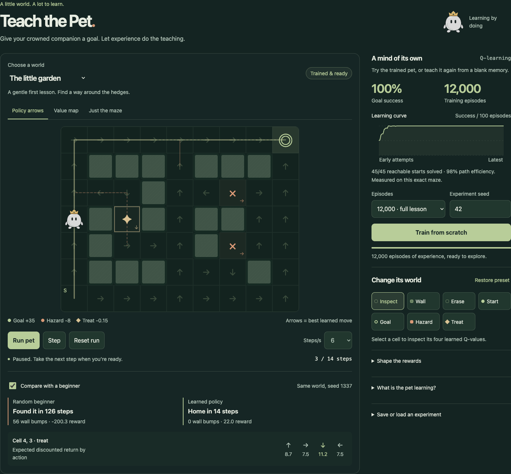
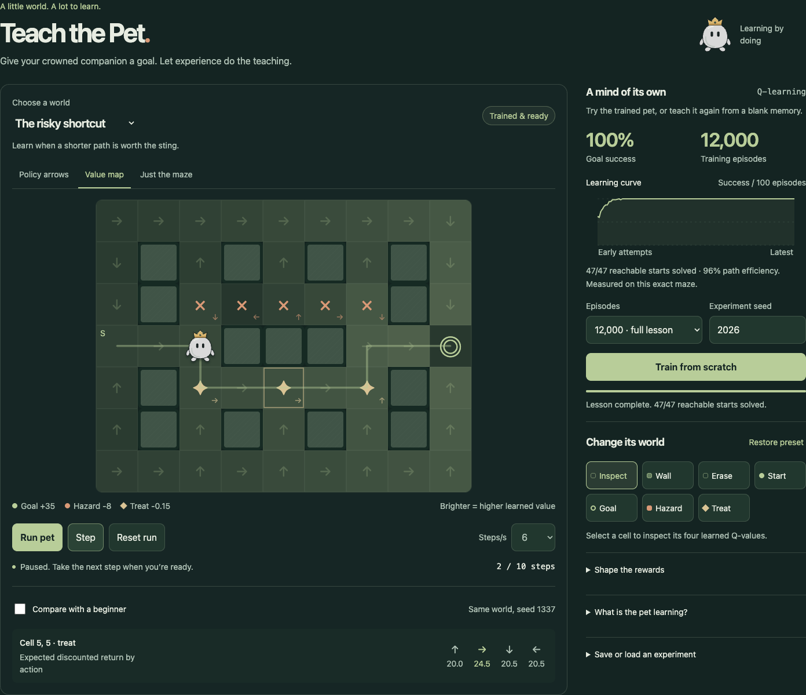

# Teach the Pet

A crowned blob learns its way through a maze using real **tabular Q-learning**. Run one of three pretrained worlds, compare the result with a random beginner, or change the world and teach the pet again. The standalone app and the embeddable portfolio experiment use exactly the same implementation.





## Run

Node 22 or newer is required.

```sh
npm install
npm run dev       # http://127.0.0.1:5181
npm run build
npm test
npm run test:browser
npm run capture
npm run train     # deterministically regenerate the shipped policies and evaluation.json
```

Browser tests and capture scripts start a local Vite server when one is not already running. They use Playwright's Chromium channel; install it with `npx playwright install chromium` if needed.

## Try it

- Choose one of three trained mazes and click **Run pet**. Pause, step, reset, and change the playback rate.
- Turn on **Compare with a beginner** to see an actual seeded random walk alongside the learned route, including measured steps, wall collisions, and cumulative reward. The overlay shows the complete attempt; the pet follows the learned route.
- Inspect any cell's four learned action values. **Policy arrows** show the greedy choice. **Value map** adds a brighter background to cells with a greater maximum learned action value.
- Select Wall, Erase, Start, Goal, Hazard, or Treat, then click or tap a cell. Use arrow keys to move keyboard focus, and Enter or Space to apply the selected brush. Start and goal are protected from tile painting; use their dedicated brushes to move them.
- Under **Shape the rewards**, change hazard or treat costs. A costly hazard can make a longer path preferable. A regression test demonstrates an 8-step shortcut becoming a 10-step detour as its hazard becomes expensive.
- Every layout or reward edit clears the policy. Set an episode budget and experiment seed, then train from a fresh Q-table. Cancel preserves a previously matching policy if one existed. A blocked start produces an actionable warning.
- Export a JSON file containing the maze, reward costs, and matching policy. Import validates dimensions, tile types, coordinates, costs, map identity, table size, finite values, and a 250 KB size limit. Imported tables are evaluated again; their claimed training history is not trusted.

## What the algorithm does

For each transition, the learner updates only the experienced state/action entry:

```
Q(s,a) ← Q(s,a) + 0.2 × [r + 0.94 × max Q(s',·) − Q(s,a)]
```

The bootstrap term is zero on reaching the terminal goal. Actions are epsilon-greedy, with random tie-breaking during training. Epsilon decreases from 1 to 0.04 over the first 72% of the requested episodes. Greedy evaluation uses stable tie-breaking. A seeded PRNG makes reruns reproducible.

Each episode starts at the selected start with probability 25%, or a random non-wall/non-goal cell otherwise. Each attempt is bounded to 252 steps. No shortest-path answers, goal distances, or hand-authored direction sequences enter the learner. Breadth-first distances are used **only** for reporting reachable starts, checking whether the configured start is sealed off, and measuring path efficiency.

Default transition rewards:

| Transition | Reward |
| --- | ---: |
| Normal move | −1 |
| Wall or boundary collision | −3 |
| Hazard entry | −8 (editable from −20 to −1) |
| Treat entry | −0.15 (editable from −1 to −0.05) |
| Goal entry | +35, ends episode |

Treats are a reduced step cost, not a collectible inventory system. Their negative net reward avoids an infinite positive-reward farming cycle without adding hidden state.

The implementation follows off-policy temporal-difference control described in [Sutton & Barto's chapter on Q-learning](https://people.cs.umass.edu/~barto/courses/cs687/Chapter%206.pdf). This project is a small educational implementation, not a general-purpose AI system.

## Measured results

The offline script trains each maze for 12,000 episodes under **three independent training seeds: 42, 2026, and 8841**. The bundled interactive presets use seed 42. Every resulting greedy policy is tested from every cell connected to the goal (excluding the goal itself). This is exhaustive starting-position evaluation on each preset, not a claim of generalization to unseen layouts. The evaluation seed affects the random baseline; greedy trained evaluations are deterministic.

| Maze | Reachable starts | Random baseline success | Trained success, all 3 seeds | Trained path efficiency |
| --- | ---: | ---: | ---: | ---: |
| The little garden | 45 | 46.7% | 100% | 98.4% |
| The long way home | 41 | 34.1% | 100% | 98.8% |
| The risky shortcut | 47 | 74.5% | 100% | 96.1% |

Path efficiency is shortest unweighted path length divided by the actual number of steps. Failures score zero. Reward-maximizing hazard avoidance may legitimately take a longer route, so perfect goal success need not imply 100% shortest-path efficiency. The UI evaluation reports this same metric. The comparison on the board uses a separate fixed attempt seed, 1337; the exhaustive random baseline uses seed 91827 plus a deterministic per-start offset.

[Full evaluation JSON](evaluation.json) includes all individual starts, shortest lengths, actual steps, rewards, efficiencies, and training seeds. The chart uses the actual outcomes of each 100-episode training window, including exploration; it is not the greedy evaluation curve.

## Embed

```js
import { mountExperiment, metadata } from '@zachshotamartin/teach-the-pet';
import '@zachshotamartin/teach-the-pet/style.css';

const experiment = mountExperiment(element, { embedded: true });
// On unmount:
experiment.dispose();
```

`mountExperiment` returns `{ dispose() }` synchronously. `embedded: true` hides the standalone title/intro because the host supplies them. Metadata includes `id`, `title`, `description`, `instructions` (array), `limitations` (array), and `technique`. All library styles are scoped to `.teach-pet`; the host's font is inherited. No public asset paths are required, so `assetBase` is unnecessary. The worker is resolved by Vite from `import.meta.url`.

Training runs in a bounded, cancellable Web Worker. Progress and completion messages carry job IDs and are rejected after an edit, reset, cancellation, or disposal. Training pauses when the document is hidden or the experiment is offscreen. Playback pauses in those states and requires explicit resumption. Disposal terminates the worker and removes timers, observers, event listeners, download URLs, and the owned DOM subtree. No server, paid API, or runtime dependency is used.

## Scope and limits

- A fixed 9 × 7 state space with four directional actions. Policies are tied to exact tile locations, start, goal, hazard cost, and treat cost.
- Training is capped at 30,000 episodes and 252 steps per episode. Difficult custom mazes can need more practice, and no learner can solve a sealed start.
- Disconnected walkable cells can be sampled during training and lower the exploratory training success curve; final success is evaluated only on goal-reachable starts.
- Value colors represent learned discounted returns, not calibrated confidence or probabilities.
- Imported policies may be arbitrary finite tables. They are validated and tested, not certified as trained or optimal.

The crowned pet artwork is adapted from Zachary Martin's portfolio `BlobPetArtwork` and `Crown` components. Both showcase images are actual browser captures from this app, regenerated by `npm run capture`; the second includes an actual fresh training run with seed 2026.
